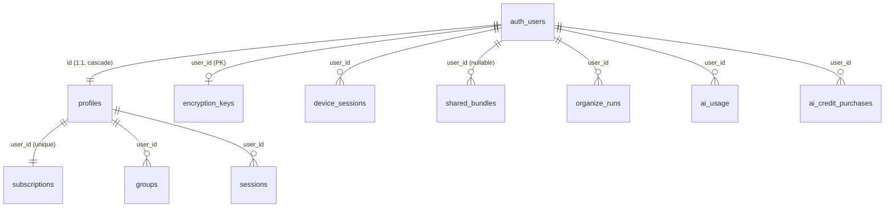

# Database Schema Reference

This is the per-table reference: columns, RLS, indexes and E2E encryption. For the day-to-day workflow (local stack, migrations, sync, queries) see [DATABASE.md](DATABASE.md).

The migrations in `supabase/migrations/` (`001`–`018`) are the source of truth. This doc is a snapshot of their end state, so read the SQL before relying on it for anything security-relevant.

## Migration history

| # | File | What it did |
|---|------|-------------|
| 001 | `001_initial_schema.sql` | `profiles`, `subscriptions`, `groups`, `sessions`. `handle_new_user()` trigger. `update_updated_at()` triggers on `groups` and `subscriptions`. |
| 002 | `002_rls_policies.sql` | RLS and owner-only policies on the four initial tables. |
| 003 | `003_indexes.sql` | Indexes on `groups`, `sessions`, `subscriptions`. |
| 004 | `004_create_organize_runs.sql` | `organize_runs` table and RLS. |
| 005 | `005_subscription_lifecycle_columns.sql` | `subscriptions.cancel_at_period_end` and `stripe_price_id`. `current_period_end` was already there, so its `add column if not exists` is a no-op. |
| 006 | `006_ai_usage.sql` | `ai_usage` table (monthly AI quota) and RLS. |
| 007 | `007_public_group_sharing.sql` | `groups.public_slug` and `view_count`. `increment_group_view_count()` function. |
| 008 | `008_groups_missing_columns.sql` | `groups.permanent`, `starred`, `archived`, `note`. |
| 009 | `009_create_shared_bundles.sql` | `shared_bundles` table (public multi-group share snapshots) and RLS. |
| 010 | `010_grant_table_privileges.sql` | Grants only, no schema change (see [Grants](#grants-migration-010)). |
| 011 | `011_enable_realtime_groups.sql` | Adds `public.groups` to the `supabase_realtime` publication. |
| 012 | `012_dedupe_and_unique_subscriptions.sql` | Deletes duplicate `subscriptions` rows, keeping the newest per user. Adds `subscriptions_user_id_key UNIQUE(user_id)`. Drops the now-redundant `subscriptions_user_id_idx`. |
| 013 | `013_create_device_sessions.sql` | `device_sessions` table (per-device Now Open snapshots) and RLS. |
| 014 | `014_ai_credit_purchases.sql` | `ai_credit_purchases` table (one-time AI credit packs) and RLS. |
| 015 | `015_encryption_keys.sql` | `encryption_keys` table (wrapped E2E data key per user). Select/insert/update policies. |
| 016 | `016_group_counts.sql` | `groups.window_count` and `tab_count`, plaintext denormalized counts, backfilled from existing plaintext `windows`. |
| 017 | `017_rename_ai_usage_credits.sql` | Renames `ai_usage.request_count` to `credits_used` (weighted credits). |
| 018 | `018_encryption_keys_delete_policy.sql` | Adds the missing `encryption_keys` delete policy. Without it, `resetEncryption()` silently deleted 0 rows. |

> **Local ≠ hosted.** `supabase db reset` proves only that the migrations apply locally. It does not show that the hosted project has them: 009 and 010 once sat unapplied on Cloud until someone ran `supabase db push` by hand. Check `supabase migration list --linked` against **each** hosted project (preview and production, see [ARCHITECTURE.md § Environments](ARCHITECTURE.md#environments)).

## E2E-encrypted columns

For every signed-in Pro account, content is written as an `EncryptedBlob` `{v:1, iv, ct}`: AES-256-GCM, base64, from `packages/shared/src/crypto`. The server never holds the key. Readers call `isEncryptedBlob()` and still accept legacy plaintext rows, because older rows were never backfilled.

| Table | Ciphertext column | What's inside the blob | Plaintext columns blanked on write |
|---|---|---|---|
| `groups` | `windows` (jsonb) | `{name, windows, note, info}` | `name = ''`, `note = null`, `info = ''` |
| `sessions` | `groups` (jsonb) | `{name, groups, description}` | `name = ''`, `description = null` |
| `device_sessions` | `now_open_snapshot` (jsonb) | `{windows}` of the device's Now Open group | none (`device_name` stays plaintext) |
| `shared_bundles` | `groups_snapshot` (jsonb) | the shared `Group[]` | none |

- `groups`, `sessions` and `device_sessions` use the account data key. That key is wrapped in `encryption_keys` and cached unwrapped in the extension's `chrome.storage.local` (see `packages/extension/src/lib/encryptionKey.ts`). The web dashboard caches it in `sessionStorage` after a passphrase prompt.
- `shared_bundles` uses a **fresh per-share key**, returned once and carried only in the share URL's `#key=` fragment. The extension encrypts on the client (`src/lib/sharing.ts`). The web route `POST /api/share-bundle` receives client-decrypted groups and encrypts them on the server with a new key that it never stores.
- Anything the server has to show without the key is kept in plaintext on purpose: `groups.color`, `starred`, `archived`, `updated_at`, `window_count`, `tab_count`.
- Server code must never treat these columns as plaintext. Run the `encrypted-column-auditor` agent on any API route that touches them.

## Tables

### `profiles`

This table extends `auth.users` with one row per user, created by `handle_new_user()`.

| Column | Type | Constraints |
|---|---|---|
| `id` | `uuid` | PK, `references auth.users(id) on delete cascade` |
| `email` | `text` | not null |
| `stripe_customer_id` | `text` | unique, nullable |
| `created_at` | `timestamptz` | not null, default `now()` |

**RLS:** `profiles_select_own` and `profiles_update_own` (`auth.uid() = id`). There is no insert or delete policy. Rows come only from the trigger (`security definer`) or the service role.

### `subscriptions`

There is **one row per user**, enforced by `subscriptions_user_id_key UNIQUE(user_id)` since migration 012. `handle_new_user()` creates the `'free_' || user_id` row. The Stripe webhook updates it with `upsert(..., { onConflict: 'user_id' })`.

| Column | Type | Constraints |
|---|---|---|
| `id` | `text` | PK. Stripe subscription id, or `'free_' \|\| user_id` for the trigger row |
| `user_id` | `uuid` | not null, unique, `references profiles(id) on delete cascade` |
| `tier` | `text` | not null, default `'free'`, one of `free`, `pro`, `pro_ai` |
| `status` | `text` | not null, default `'active'`, one of `active`, `canceled`, `past_due`, `trialing`, `incomplete` |
| `current_period_end` | `timestamptz` | nullable |
| `cancel_at_period_end` | `boolean` | default `false` (005) |
| `stripe_price_id` | `text` | nullable (005) |
| `created_at` | `timestamptz` | not null, default `now()` |
| `updated_at` | `timestamptz` | not null, default `now()`, bumped by trigger |

**RLS:** `subscriptions_select_own` only. Writes go through the service role (webhook) and the trigger.

**Indexes:** `subscriptions_status_idx` and the unique index behind `subscriptions_user_id_key`.

> Anything that INSERTs a second row for a user fails with `23505` on `subscriptions_user_id_key`, because the trigger has already created one. `supabase/seed.sql` still does this (open, see [TODO.md](../TODO.md)).

### `groups`

Groups are synced from the extension. Local IndexedDB is written first, then `syncEngine.ts` upserts here.

| Column | Type | Constraints / notes |
|---|---|---|
| `id` | `text` | PK, generated by the extension |
| `user_id` | `uuid` | not null, `references profiles(id) on delete cascade` |
| `name` | `text` | not null. `''` when encrypted |
| `color` | `text` | not null, default `'rgba(128,128,128,1)'` |
| `position` | `integer` | not null, default `0`. The extension's sync push does not write it |
| `windows` | `jsonb` | not null, default `'[]'`. `ExtWindow[]`, or an `EncryptedBlob` |
| `info` | `text` | nullable. `''` when encrypted |
| `note` | `text` | nullable (008). `null` when encrypted |
| `permanent` | `boolean` | not null, default `false` (008). The Now Open group is never pushed |
| `starred` | `boolean` | not null, default `false` (008) |
| `archived` | `boolean` | not null, default `false` (008) |
| `public_slug` | `text` | unique, nullable (007). Set by `POST /api/groups/[id]/publish` |
| `view_count` | `integer` | not null, default `0` (007) |
| `window_count` | `integer` | not null, default `0` (016). Plaintext; the client computes it before encrypting |
| `tab_count` | `integer` | not null, default `0` (016). Same as `window_count` |
| `updated_at` | `timestamptz` | not null, default `now()`, bumped by trigger. The last-write-wins key |
| `created_at` | `timestamptz` | not null, default `now()` |

**RLS:** full owner CRUD (`groups_select_own`, `_insert_own`, `_update_own`, `_delete_own`). No public select policy exists.

**Realtime:** in the `supabase_realtime` publication (011). RLS applies to subscriptions.

**Function:** `increment_group_view_count(slug_param text)` is `security definer` and has no auth check inside. Nothing in the app calls it today.

**Indexes:** `groups_user_id_idx`, `groups_updated_at_idx (desc)`.

### `sessions`

Point-in-time snapshots of a user's groups. They are copies, not references to `groups.id`.

| Column | Type | Constraints |
|---|---|---|
| `id` | `text` | PK |
| `user_id` | `uuid` | not null, `references profiles(id) on delete cascade` |
| `name` | `text` | not null. `''` when encrypted |
| `description` | `text` | nullable. `null` when encrypted |
| `groups` | `jsonb` | not null, default `'[]'`. `Group[]`, or an `EncryptedBlob` |
| `created_at` | `timestamptz` | not null, default `now()` |

**RLS:** full owner CRUD. **Index:** `sessions_user_id_idx`.

### `device_sessions`

One row per (user, device) for "Continue on other device". Other devices of the **same** user read it. It does not share across users.

| Column | Type | Constraints |
|---|---|---|
| `id` | `uuid` | PK, default `gen_random_uuid()` |
| `user_id` | `uuid` | not null, `references auth.users(id) on delete cascade` |
| `device_id` | `text` | not null. Generated by the client, unique per user |
| `device_name` | `text` | not null, plaintext |
| `now_open_snapshot` | `jsonb` | not null, default `'[]'`. An `EncryptedBlob` for encrypted accounts |
| `last_active` | `timestamptz` | not null, default `now()` |
| `created_at` | `timestamptz` | not null, default `now()` |
| — | — | `unique(user_id, device_id)`. The extension upserts with `onConflict: 'user_id,device_id'` |

**RLS:** full owner CRUD (`device_sessions_*_owner`). **Index:** `device_sessions_user_id_last_active_idx (user_id, last_active)`.

### `shared_bundles`

Immutable public share snapshots of one or more groups. `/share/[slug]` reads them.

| Column | Type | Constraints |
|---|---|---|
| `id` | `uuid` | PK, default `gen_random_uuid()` |
| `slug` | `text` | unique, not null |
| `user_id` | `uuid` | nullable, `references auth.users(id) on delete cascade` |
| `groups_snapshot` | `jsonb` | not null. An `EncryptedBlob` (per-share key), or legacy plaintext |
| `created_at` | `timestamptz` | default `now()` |
| `expires_at` | `timestamptz` | nullable |

**RLS:** `shared_bundles_select_public` uses `using (true)`, so **anyone can read**. `shared_bundles_insert_owner` is limited to `authenticated` with `user_id = auth.uid()`. `shared_bundles_delete_owner` requires `user_id = auth.uid()`. There is **no update policy** because snapshots are immutable. **Index:** on `slug`.

### `encryption_keys`

One row per user: the E2E data key wrapped with a key derived from the user's passphrase. The server never sees the passphrase or the unwrapped key.

| Column | Type | Constraints |
|---|---|---|
| `user_id` | `uuid` | PK, `references auth.users(id) on delete cascade` |
| `wrapped_key` | `text` | not null. The AES-256 data key, AES-GCM-wrapped |
| `salt` | `text` | not null. PBKDF2 salt |
| `kdf_iterations` | `integer` | not null. PBKDF2 iterations (`KDF_ITERATIONS` = 600,000 for new keys) |
| `wrap_iv` | `text` | not null |
| `created_at` | `timestamptz` | not null, default `now()` |

**RLS:** owner select, insert, update (015) and delete (018).

### `organize_runs`

Maps an AI "organize" workflow run to its owner, so `GET /api/ai/organize` can check ownership before streaming. No result data is stored.

| Column | Type | Constraints |
|---|---|---|
| `run_id` | `text` | PK |
| `user_id` | `uuid` | not null, `references auth.users(id) on delete cascade` |
| `created_at` | `timestamptz` | default `now()` |

**RLS:** one `for all` policy, `"users see own runs"` (`auth.uid() = user_id`).

### `ai_usage`

Per-user, per-month AI credit counter. `credits_used` adds up a **weighted** cost per call (`CREDIT_COSTS` in `packages/web/lib/ai-usage.ts`).

| Column | Type | Constraints |
|---|---|---|
| `id` | `uuid` | PK, default `gen_random_uuid()` |
| `user_id` | `uuid` | not null, `references auth.users(id) on delete cascade` |
| `month` | `text` | not null, `'YYYY-MM'` |
| `credits_used` | `integer` | not null, default `0` (was `request_count` before 017) |
| — | — | `unique(user_id, month)` |

**RLS:** `"Users can read own usage"`, select only. The AI routes increment it through the service role. The effective cap is `AI_MONTHLY_CAP` (300) plus the sum of `ai_credit_purchases.credits` for that month (`getEffectiveCap`).

### `ai_credit_purchases`

One-time AI credit packs. They are month-scoped and don't roll over. There is one row per Stripe Checkout session, so webhook redelivery is idempotent.

| Column | Type | Constraints |
|---|---|---|
| `id` | `uuid` | PK, default `gen_random_uuid()` |
| `user_id` | `uuid` | not null, `references auth.users(id) on delete cascade` |
| `month` | `text` | not null, `'YYYY-MM'` |
| `credits` | `integer` | not null |
| `stripe_checkout_session_id` | `text` | not null, unique |
| `created_at` | `timestamptz` | not null, default `now()` |

**RLS:** `"Users can read own credit purchases"`, select only. Only the Stripe webhook (service role) writes. **Index:** `ai_credit_purchases_user_month_idx (user_id, month)`.

## Grants (migration 010)

Local CLI stacks don't get the schema-level grants to `anon`/`authenticated` that Supabase Cloud provisions implicitly. Without them, Postgres rejects a query before RLS is even evaluated. Migration 010 grants `select, insert, update, delete` on all public tables, and on future ones via `alter default privileges`. RLS remains the access control.

## How tables relate

- `profiles`, `subscriptions`, `groups` and `sessions` reference `public.profiles`. Every later table references `auth.users` directly. The two are equivalent in practice, because `profiles.id` cascades 1:1 from `auth.users.id`.
- `profiles` and `subscriptions` are managed by the trigger. Never INSERT into them from app code.
- `sessions.groups` and `shared_bundles.groups_snapshot` are **copies**. Editing or deleting a group later does not change them.
- Every FK is `on delete cascade`, so deleting an auth user removes their rows from all ten tables. `groups.archived` is a flag, not a soft-delete table.

## TypeScript mirrors (`packages/shared/src/types/index.ts`)

These types only partly mirror the schema:

- `SupabaseGroup` is missing `public_slug`, `view_count`, `permanent`, `starred`, `archived` and `note`. It types `windows` as `ExtWindow[]` even though the value can be an `EncryptedBlob`.
- `Subscription` doesn't model `cancel_at_period_end` or `stripe_price_id`. `useEntitlements` selects them with its own local row type.
- `DeviceSession` covers `device_id`, `device_name`, `now_open_snapshot` and `last_active`.
- There are no shared types for `shared_bundles`, `encryption_keys`, `organize_runs`, `ai_usage` or `ai_credit_purchases`.
