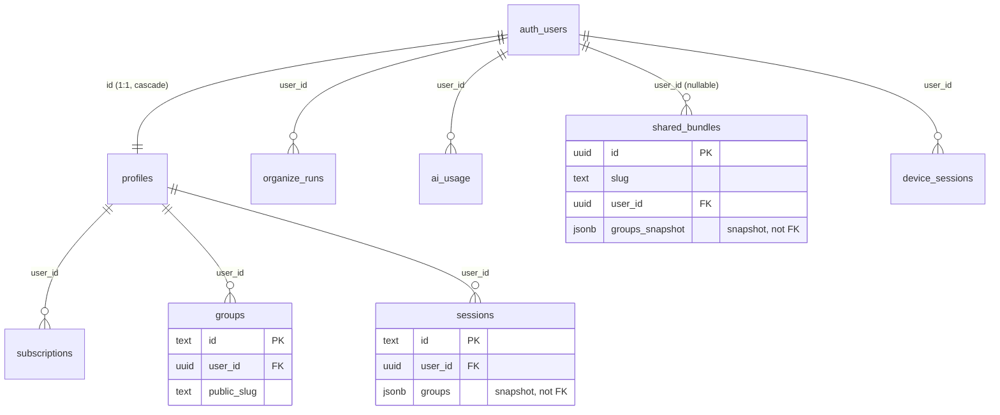

# Database Schema Reference

Source of truth: `supabase/migrations/001` through `014`. Read the actual SQL before trusting
this doc for anything security-relevant — it's a snapshot, not a replacement for the migrations.

## Migration history

| # | File | What it did |
|---|------|-------------|
| 001 | `001_initial_schema.sql` | Creates `profiles`, `subscriptions`, `groups`, `sessions`; `handle_new_user()` trigger; `update_updated_at()` trigger |
| 002 | `002_rls_policies.sql` | Enables RLS + owner-only policies on the 4 initial tables |
| 003 | `003_indexes.sql` | Performance indexes on `groups`, `sessions`, `subscriptions` |
| 004 | `004_create_organize_runs.sql` | Adds `organize_runs` table + RLS |
| 005 | `005_subscription_lifecycle_columns.sql` | Adds `cancel_at_period_end`, `current_period_end` (redundant add, already existed), `stripe_price_id` to `subscriptions` |
| 006 | `006_ai_usage.sql` | Adds `ai_usage` table (AI request quota tracking) + RLS |
| 007 | `007_public_group_sharing.sql` | Adds `public_slug`, `view_count` to `groups`; adds `increment_group_view_count()` RPC |
| 008 | `008_groups_missing_columns.sql` | Adds `permanent`, `starred`, `archived`, `note` to `groups` (columns existed on the TS `Group` type but were missing from the DB — caused live sync failures) |
| 009 | `009_create_shared_bundles.sql` | Adds `shared_bundles` table (immutable public share snapshots) + RLS |
| 010 | `010_grant_table_privileges.sql` | Grants-only migration, no schema change — see callout below |
| 011 | `011_enable_realtime_groups.sql` | Adds `public.groups` to the `supabase_realtime` publication so clients (e.g. the web dashboard's `SyncIndicator`) can subscribe to live `postgres_changes` events. No RLS change — existing `groups` policies (owner-only, `auth.uid() = user_id`) already gate Realtime subscriptions. |
| 012 | `012_dedupe_and_unique_subscriptions.sql` | Dedupes/uniques `subscriptions` rows — no `device_sessions`-relevant schema impact. |
| 013 | `013_create_device_sessions.sql` | Adds `device_sessions` table (per-device "Now Open" snapshots for the "Continue on other device" feature) + RLS |
| 014 | `014_ai_credit_purchases.sql` | Adds `ai_credit_purchases` table (one-time purchased AI credit packs, month-scoped, idempotent via `stripe_checkout_session_id`) + RLS |

> **Keeping hosted Cloud in sync:** migrations 009 and 010 existed in this repo and were applied
> to the local Supabase CLI stack, but were never pushed to the hosted Supabase Cloud project.
> They sat un-applied on Cloud until `supabase db push` was run manually this session. Local
> `supabase db reset` gives false confidence that "the schema is applied" — it only proves the
> migration is valid SQL, not that Cloud has it. Always confirm with `supabase migration list
> --linked` (or check the Cloud dashboard's migration history) before assuming parity, especially
> after a migration was written but not immediately deployed.

## Tables

### `profiles`
Extends `auth.users`. One row per user, auto-created by the `handle_new_user()` trigger.

| Column | Type | Constraints |
|---|---|---|
| `id` | `uuid` | PK, `references auth.users(id) on delete cascade` |
| `email` | `text` | not null |
| `stripe_customer_id` | `text` | unique, nullable |
| `created_at` | `timestamptz` | not null, default `now()` |

**RLS:** `profiles_select_own` (select where `auth.uid() = id`), `profiles_update_own` (update where
`auth.uid() = id`). No insert/delete policy for regular users — rows are only ever created by the
trigger (`security definer`) or the service role.

TS counterpart: `Profile` in `packages/shared/src/types/index.ts` (camelCase — `stripeCustomerId`).

### `subscriptions`
One row per user, auto-created as `'free'` by `handle_new_user()`. Stripe is the source of truth;
webhooks keep this table in sync (see `payments` agent domain).

| Column | Type | Constraints |
|---|---|---|
| `id` | `text` | PK — Stripe subscription id (or `'free_' \|\| user_id` for the trigger-created free tier) |
| `user_id` | `uuid` | not null, `references profiles(id) on delete cascade` |
| `tier` | `text` | not null, default `'free'`, check in (`free`, `pro`, `pro_ai`) |
| `status` | `text` | not null, default `'active'`, check in (`active`, `canceled`, `past_due`, `trialing`, `incomplete`) |
| `current_period_end` | `timestamptz` | nullable |
| `created_at` | `timestamptz` | not null, default `now()` |
| `updated_at` | `timestamptz` | not null, default `now()`, auto-bumped by `update_updated_at()` trigger |
| `cancel_at_period_end` | `boolean` | added in 005, default `false` |
| `stripe_price_id` | `text` | added in 005, nullable |

**RLS:** `subscriptions_select_own` only (select where `auth.uid() = user_id`). No client-side
insert/update/delete policy — writes only happen via the service role in the Stripe webhook
handler and the `handle_new_user()` trigger.

TS counterpart: `Subscription` (camelCase). Note the TS type doesn't yet model
`cancel_at_period_end`/`stripe_price_id` — check before relying on those fields client-side.

### `groups`
Local-first synced tab groups. Extension writes to IndexedDB first, then upserts here via
`syncEngine.ts`. Columns accumulated across migrations 001, 007, 008, 016.

| Column | Type | Constraints |
|---|---|---|
| `id` | `text` | PK — nanoid from extension |
| `user_id` | `uuid` | not null, `references profiles(id) on delete cascade` |
| `name` | `text` | not null |
| `color` | `text` | not null, default `'rgba(128,128,128,1)'` |
| `position` | `integer` | not null, default `0` |
| `windows` | `jsonb` | not null, default `'[]'` — array of `ExtWindow` |
| `info` | `text` | nullable |
| `updated_at` | `timestamptz` | not null, default `now()`, auto-bumped by trigger — this is the last-write-wins conflict key |
| `created_at` | `timestamptz` | not null, default `now()` |
| `public_slug` | `text` | added in 007, unique, nullable — set when a group is shared |
| `view_count` | `integer` | added in 007, not null, default `0` |
| `permanent` | `boolean` | added in 008, not null, default `false` — true only for the "Now Open" group |
| `starred` | `boolean` | added in 008, not null, default `false` |
| `archived` | `boolean` | added in 008, not null, default `false` |
| `window_count` | `integer` | added in 016, not null, default `0` — denormalized plaintext count, maintained by the client on every write so SSR stat tiles work even once `windows` is E2EE ciphertext |
| `tab_count` | `integer` | added in 016, not null, default `0` — denormalized plaintext count, maintained by the client on every write, same reason as `window_count` |
| `note` | `text` | added in 008, nullable |

**RLS:** full owner CRUD — `groups_select_own`, `groups_insert_own`, `groups_update_own`,
`groups_delete_own`, all gated on `auth.uid() = user_id`. There is **no public select policy** for
rows with a `public_slug` set — the public share page reads via the service role client, not
anon/RLS.

**RPC:** `increment_group_view_count(slug_param text)` — `security definer`, updates
`view_count` by slug. Called from the share page with the service role (best-effort, no auth
check inside the function itself).

**Indexes:** `groups_user_id_idx`, `groups_updated_at_idx (desc)`.

TS counterpart: `Group` (app-facing, camelCase, no `user_id`/`position`) and `SupabaseGroup`
(DB-shaped, snake_case) in `packages/shared/src/types/index.ts`. Note `SupabaseGroup` in the
shared types file has **not** been updated to include `public_slug`, `view_count`, `permanent`,
`starred`, `archived`, or `note` — those columns exist in the DB (migrations 007/008) but aren't
reflected in that type yet. Cross-check before assuming the TS type is exhaustive.

### `sessions`
Saved point-in-time snapshots of a user's groups (not a live reference — see relationships below).

| Column | Type | Constraints |
|---|---|---|
| `id` | `text` | PK |
| `user_id` | `uuid` | not null, `references profiles(id) on delete cascade` |
| `name` | `text` | not null |
| `description` | `text` | nullable |
| `groups` | `jsonb` | not null, default `'[]'` — array of `Group` snapshots, not FKs to `groups.id` |
| `created_at` | `timestamptz` | not null, default `now()` |

**RLS:** full owner CRUD (`sessions_select_own/insert_own/update_own/delete_own`, all on
`auth.uid() = user_id`).

**Index:** `sessions_user_id_idx`.

TS counterpart: `Session` (camelCase) and `SupabaseSession` (snake_case).

### `organize_runs`
Tracks AI "organize my tabs" runs (added migration 004). Minimal — no result data stored here,
just an existence record per run.

| Column | Type | Constraints |
|---|---|---|
| `run_id` | `text` | PK |
| `user_id` | `uuid` | not null, `references auth.users(id) on delete cascade` |
| `created_at` | `timestamptz` | default `now()` |

**RLS:** single `for all` policy `"users see own runs"` using `auth.uid() = user_id` — covers
select/insert/update/delete in one policy (unlike other tables which split by operation).

Note: FK targets `auth.users` directly, not `public.profiles`, unlike every other table in this
schema.

### `ai_usage`
Per-user, per-month AI credit counter — enforces the pro_ai tier's monthly credit quota. As of
migration 017, `credits_used` accumulates a *weighted* cost per call (e.g. `group-tabs` costs ~8x
`name-group`) rather than a flat call count — renamed from `request_count` to reflect this.

| Column | Type | Constraints |
|---|---|---|
| `id` | `uuid` | PK, default `gen_random_uuid()` |
| `user_id` | `uuid` | not null, `references auth.users(id) on delete cascade` |
| `month` | `text` | not null — format `'YYYY-MM'` |
| `credits_used` | `integer` | not null, default `0` |
| — | — | `unique(user_id, month)` — one row per user per month |

**RLS:** `"Users can read own usage"` — select only, `auth.uid() = user_id`. No insert/update
policy for regular users — increments happen via the service role in the AI API routes (see
`ai-features` agent domain).

Note: also FKs to `auth.users` directly, not `public.profiles`.

### `ai_credit_purchases`
One-time purchased AI credit packs (e.g. "+50 calls for $2.99") that top up a user's `ai_usage`
allowance for that calendar month. Credits expire at month-end, same cadence as the free monthly
cap — no rollover, no running balance across months. Kept as a separate table (not a column on
`ai_usage`) so each Stripe checkout session is recorded individually, giving idempotency against
webhook redelivery.

| Column | Type | Constraints |
|---|---|---|
| `id` | `uuid` | PK, default `gen_random_uuid()` |
| `user_id` | `uuid` | not null, `references auth.users(id) on delete cascade` |
| `month` | `text` | not null — format `'YYYY-MM'`, matches `ai_usage.month` |
| `credits` | `integer` | not null |
| `stripe_checkout_session_id` | `text` | not null, unique — enforces idempotency on webhook redelivery |
| `created_at` | `timestamptz` | not null, default `now()` |

Index: `ai_credit_purchases_user_month_idx` on `(user_id, month)`.

**RLS:** `"Users can read own credit purchases"` — select only, `auth.uid() = user_id`. No
insert/update policy for regular users — only the Stripe webhook, using the service-role client,
writes purchase rows.

Note: also FKs to `auth.users` directly, not `public.profiles`.

**For the `ai-features` agent:** `checkAndIncrementAIUsage()`'s cap check currently compares
`credits_used` (renamed from `request_count` in migration 017) against the flat `AI_MONTHLY_CAP`.
It needs to become `credits_used + weighted_cost <= AI_MONTHLY_CAP + purchased_credits`, where
`purchased_credits` is the sum of `credits` from `ai_credit_purchases` for that `user_id`+`month`
(not implemented in this migration — application-code changes are tracked separately by the
payments/ai-features agents).

### `shared_bundles`
Immutable public share snapshots (added migration 009) — distinct from `groups.public_slug`
single-group sharing; this is for sharing a *bundle* of multiple groups at once.

| Column | Type | Constraints |
|---|---|---|
| `id` | `uuid` | PK, default `gen_random_uuid()` |
| `slug` | `text` | unique, not null |
| `user_id` | `uuid` | `references auth.users(id) on delete cascade`, nullable |
| `groups_snapshot` | `jsonb` | not null — frozen copy of groups at share time |
| `created_at` | `timestamptz` | default `now()` |
| `expires_at` | `timestamptz` | nullable |

**RLS:**
- `shared_bundles_select_public` — `using (true)`, **anyone can read any row by slug**, no auth
  required (this is the point of the table — public share pages).
- `shared_bundles_insert_owner` — insert restricted to `authenticated` role, `user_id = auth.uid()`.
- `shared_bundles_delete_owner` — delete where `user_id = auth.uid()`.
- **No update policy at all** — snapshots are immutable by design; once shared, a bundle can only
  be re-created or deleted, never edited in place.

**Index:** `on public.shared_bundles (slug)`.

Not yet reflected in `packages/shared/src/types/index.ts` — no `SharedBundle` TS type exists as of
this migration; add one if/when the sharing feature lands app-side.

### `device_sessions`
Per-device "Now Open" snapshots, added migration 013 for the "Continue on other device" feature.
Each device the extension has synced from registers/updates one row here; other devices of the
**same** user can read it to pull that device's tabs. No cross-user sharing.

| Column | Type | Constraints |
|---|---|---|
| `id` | `uuid` | PK, default `gen_random_uuid()` |
| `user_id` | `uuid` | not null, `references auth.users(id) on delete cascade` |
| `device_id` | `text` | not null — client-generated `crypto.randomUUID()`, unique **per user** only (composite unique with `user_id`, not globally unique) |
| `device_name` | `text` | not null — user-editable, defaults to a UA-derived string set by the client |
| `now_open_snapshot` | `jsonb` | not null, default `'[]'` — snapshot of the "Now Open" group's tabs at last push |
| `last_active` | `timestamptz` | not null, default `now()` |
| `created_at` | `timestamptz` | not null, default `now()` |
| — | — | `unique(user_id, device_id)` |

**RLS:** full owner CRUD — `device_sessions_select_owner`, `_insert_owner`, `_update_owner`,
`_delete_owner`, all gated on `auth.uid() = user_id`. No public/cross-user access; "other devices"
means other devices of the same authenticated user, not a sharing mechanism.

**Index:** `device_sessions_user_id_last_active_idx` on `(user_id, last_active)` — supports a
30-day staleness query (e.g. `where last_active > now() - interval '30 days'`) filtered by user.

Not yet reflected in `packages/shared/src/types/index.ts` — no `DeviceSession` TS type exists yet;
add one when the extension/web client code for this feature lands.

## Grants (migration 010)

Local `supabase` CLI stacks don't provision the schema-level `anon`/`authenticated` grants that
Supabase Cloud sets up implicitly. Without the base grant, RLS policies never even get evaluated —
Postgres rejects the query before RLS is consulted. Migration 010 is purely
`grant select, insert, update, delete on all tables in schema public to anon, authenticated` (plus
`alter default privileges` for future tables). It changes no schema — RLS policies remain the
actual access control layer; this migration only restores the baseline grant that Cloud gives you
for free.

## How tables relate

- **Ownership model:** every table has (or, for `organize_runs`/`ai_usage`/`shared_bundles`, was
  given directly) a `user_id`/`id` column pointing back to a user. `profiles.id`,
  `subscriptions.user_id`, `groups.user_id`, `sessions.user_id` all FK through `public.profiles`.
  `organize_runs.user_id`, `ai_usage.user_id`, `shared_bundles.user_id` FK straight to
  `auth.users` instead — functionally equivalent (since `profiles.id` cascades 1:1 from
  `auth.users.id`) but inconsistent, worth knowing if you're writing a query that joins through
  `profiles`.
- **`profiles` and `subscriptions` are trigger-managed, not app-managed.** `handle_new_user()`
  creates both rows the moment a user signs up. Never insert into either table directly from
  app code — you'd create duplicates or violate the unique free-subscription-per-user assumption.
- **`sessions.groups` and `shared_bundles.groups_snapshot` are snapshots, not live references.**
  Both store a `jsonb` copy of group data at the time of save/share. There is no FK from either
  column back to `groups.id` — editing or deleting a live group afterward does not affect an
  already-saved session or an already-shared bundle. If a user wants the current group state,
  they must re-save/re-share.
- **Two independent sharing mechanisms exist:** `groups.public_slug` shares a single group (read
  via service role, no RLS public-select policy on `groups` itself), while `shared_bundles` shares
  a snapshot of potentially multiple groups (read via `using (true)` public RLS policy directly on
  the table). Don't conflate the two when working on the sharing feature.
- **Cascade behavior:** every FK in this schema is `on delete cascade` — deleting a user deletes
  every row across all seven tables. There is no soft-delete/archival table; `groups.archived` is
  a boolean flag on the row itself, not a separate lifecycle table.

## Type-mirroring gaps (as of this session)

`packages/shared/src/types/index.ts` mirrors the DB tables for app-facing type safety, but is not
fully in sync with the migrations:

- `SupabaseGroup` is missing `public_slug`, `view_count`, `permanent`, `starred`, `archived`,
  `note` (added by migrations 007/008).
- No TS type exists yet for `organize_runs`, `ai_usage`, `shared_bundles`, or `device_sessions`.
- `Subscription` doesn't model `cancel_at_period_end` or `stripe_price_id` (added by migration 005).

None of this blocks anything today (the app reads/writes the fields it needs via loosely-typed
Supabase client calls), but it's worth tightening if `SupabaseGroup`/`Subscription` are used for
compile-time validation elsewhere.
